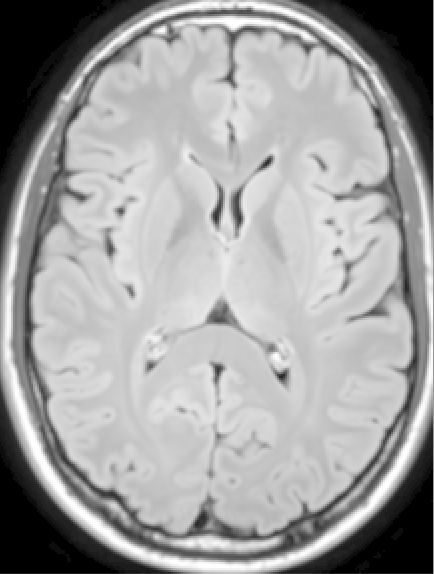

# Medical Image Processing and Documentation

Below is an overview of medical imaging software and publication information learned over the last decades.

## File Formats

There are numerous file formats used in medical imaging. Some are more common (Dicom and NIFTI) and some are less common. This page gives an overview of the [file formats](file-formats/README.md) used in medical imaging and how to load the data into Python.

## GUI Visualization

Viewing medical images quick and simply is typically better with a [GUI](gui-packages/README.md) specifically made for visualizing medical images.

## Python Packages

Thankfully there are numerous [Python packages](python-packages/README.md) built for doing medical image processing, everything from image processing (2D and 3D) to visualization.

## Code Snippets

There are many [snippets of code](code-snippets/README.md) that I have found useful over the hears.

## Medical Imaging Journals

There are numerous [medical imaging journals](journals/README.md) where one can publish. The list on the [page](journals/README.md) lists out options of journals.

## How to Write a Paper

[Learn how to](write-paper/README.md) organize information in order to write a paper.

 
Craig Jones (<a href="mailto:craig@imagingai.org">craig@imagingai.org</a>)

