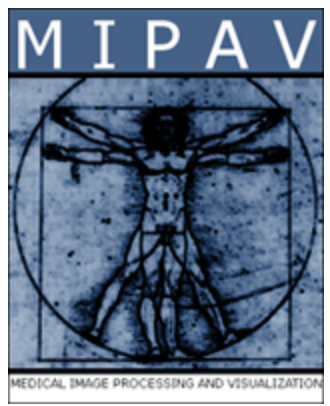

# GUI Packages

Below are the primary GUI interfaces to view and interact with medical imaging data.

## MIPAV

|* Simple free program, written in Java |  |
|* https://mipav.cit.nih.gov            |  |

## ImageJ / FUJI
* Simple free Java based solution
* https://imagej.net/software/fiji/

## MITK
* Free visulization software based on ITK
* https://www.mitk.org/wiki/The_Medical_Imaging_Interaction_Toolkit_(MITK)

## 3D Slicer
* Free software for medical image visualization and processing
* Python API to extend the features
* Reasonably complex interface but will do most things needed for processing.
* https://www.slicer.org

